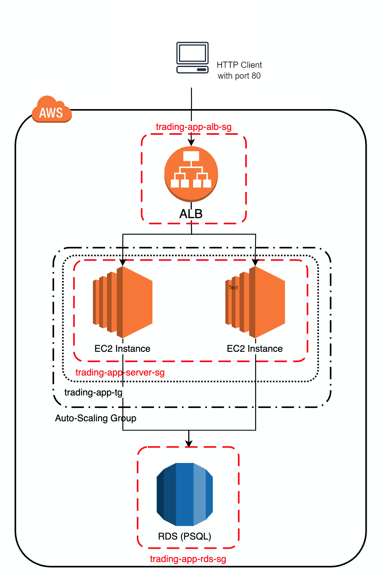
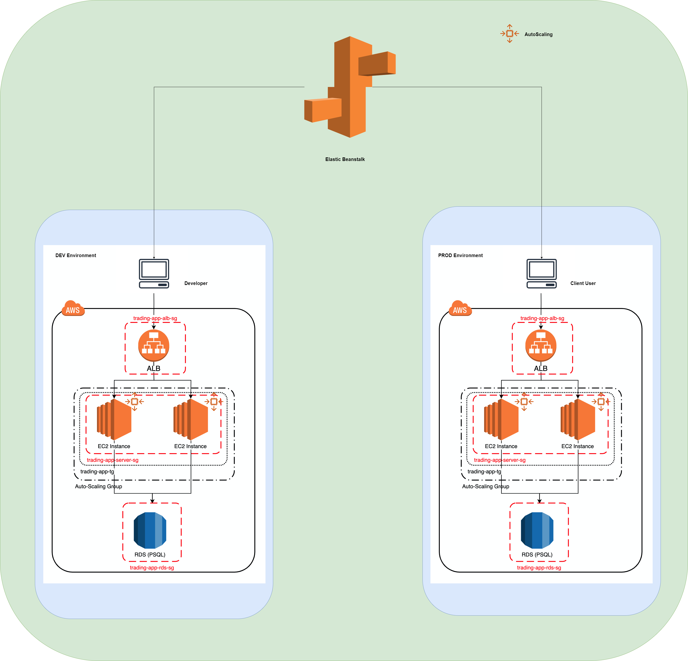
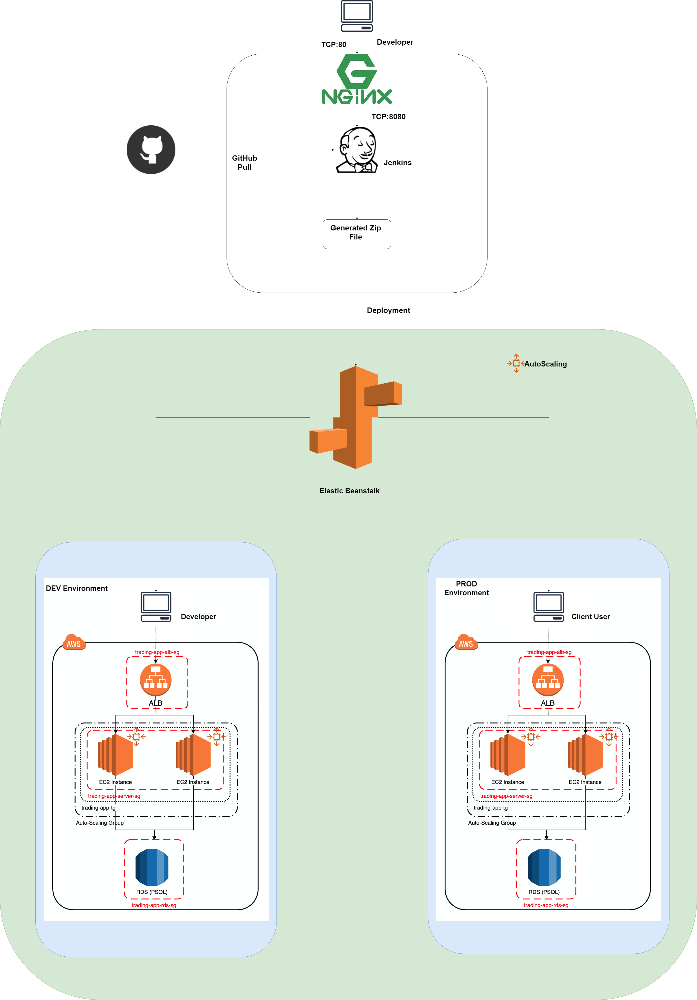

# Cloud DevOps
* [Introduction](#introduction)
* [Cloud Application Architecture](#cloud-application-architecture)
* [Deployment Environments](#deployment-environments)
* [Jenkins](#jenkins)
* [Potential Improvements](#potential-improvements)

# Introduction

In this project, I plan to migrate the [SpringBoot](../springboot) project servers to the AWS cloud. It uses three-tier architecture where data tier stores data information, the application tier handles logic and the presentation tier is a graphical user interface. In this project, the application is deployed using amazon web service. EC2 instance is used to contain the application tier and RDS database is for the data tier. The client will then be able to access the trading platform with an endpoint. Moreover, the application is also deployed with load balancer and elastic beanstalk which make it able to handle large traffic. Jenkins CI/CD pipeline is also created to make the development/deployment process easier.

# Application Cloud Architecture

- An environment configuration for our application was created in Elastic Beanstalk, including an Application Load Balancer and Auto Scaling group.
  - The load balancer: It will take incoming HTTP requests and map them to a target group, keeping the workload even across instances. The ALB also performs health checks on the instances to avoid directing requests to a dead instance.
  - The Auto Scaling group: It handles the creation and removal of EC2 instances according to the demands of incoming traffic.
  This combination of tools makes our application both scalable and elastic.
- By using an application load balancer, a new EC2 instance will be instantiated by auto scaling from the AMI image provided when the incoming traffic becomes larger than a configured threshold. Then, the ALB can route the requests to all the EC2 instances exist in the target group to improve performance. Also, the ALB will send health requests to each EC2 instance it manages. If there is no response or there are two unhealthy responses consecutively, the ALB will mark it as a failed instance and not route the request to this failed instance.

# Deployment Environments
For the development environment, elastic beanstalk (EB) is used to simplify the deployment process. For this SpringBoot trading application, two environments are created using EB: development and production.
- DEV environment is where testing happens and the PROD environment is the one that is published. To create an application, only the packaged source code is required. For a single application, it can have multiple environments (configurations). For both the DEV environment and the PROD environment in this application, they are configured to have a auto scaling group that can manage two EC2 instances (spanning three regions in East US) at most. Also, both endpoints are available at port 8080 which is the port that swagger UI is listening on. The detail of deployment using EB is shown in the following diagram.

# Jenkins Server
- To further simplify the deployment process, a tool called Jenkins is leveraged. It is an automated project build and deployment tool which can connect to GitHub and check for update constantly. The build and deployment process is specified by the JenkinsFile located in the project and it can be scheduled either periodically or in the presence of available updates. In this project, the develop branch and master branch are used for deployment in DEV env and PROD env described in the previous session. The details of the Jenkins server is illustrated in the following diagram.

# Jenkins CI/CD pipeline
The CI/CD pipeline in Jenkins is built using JenkinsFile. It can be found under the root directory of the Springboot project. JenkinsFile is responsible for deploying code in develop branch into DEV env and deploying code in the master branch into PROD env. When the process starts, Jenkins pulls the new application versions from the GitHub repository and its branches. It uses Maven's package command to build a jar, which is then deployed by Elastic Beanstalk to the appropriate environment.

# Improvements
1. Create a more strict security group only allowing SSH from the developer's IP address.
