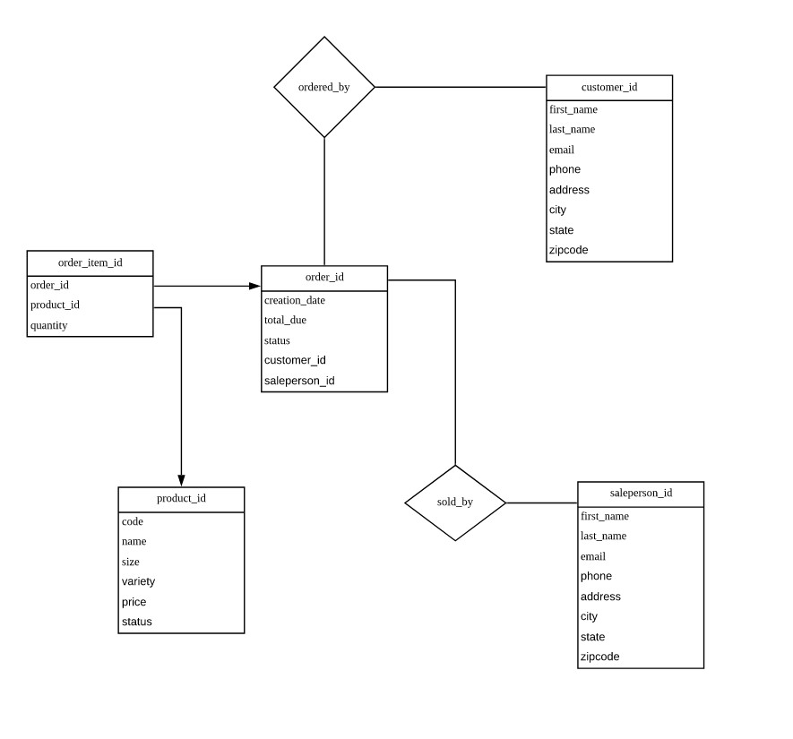

# Introduction
This application allows users to perform basic CRUD (Create, Read, Update, Delete) operations by using the JDBC API in JAVA. 
The JDBC API allows a connection between a Java-based application and a PostgreSQL database by using DAO (Data Access Object) pattern. 
Overall this project gives an idea of Data Access Object, Data Transfer Object as an interface, and doing Database Transaction by using JDBC. 
Also, get ideas about the ACID terminology by handling SQL exceptions as well as using commits and rollbacks to perform the atomic transaction in JDBC.

# ER Diagram
Below is the ER diagram of the database for this Project:

git checkout develop
# Design Patterns
The difference between DAO and Repository design pattern
## DAO (Data Access Object)
DAO provides an abstraction on database/data files or any other persistence mechanism so that, persistence layer could be manipulated without knowing its implementation details. DAO involves more complex queries since there is involvement in multiple tables. We can say, DAO is an abstraction of data persistence.

## Repository Pattern
This pattern doesn't involve complex queries, rather it focus to use simple ones.  Here, unlike DAO, repository pattern works typically on a single table or DTO by acting as an abstraction between various collection of objects.
