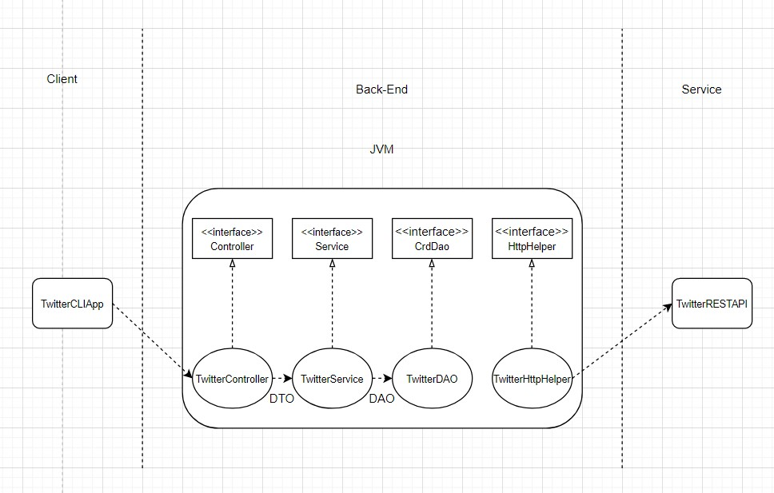

## Introduction 

This Java application is a maven based application that can post, show and delete the tweet using Twitter REST APIs.
By utilizing the Spring framwork, this twitter application can have regular `main method` approach, `@Beans` approach, `@ComponentScan` approach and SpringBoot approach.
Building this application involves the conecpts of the basics of Rest APIs, Springand Spring Bootand, the concepts of MVC architecture, Unit testing and 
 the integration testing using JUnit4 and the Mockito framework.  
## Design
The class diagram of TwitterCLI application is shown below:  


1) TwitterHttpHelper : HttpHelper builds connection between Twitter API and Java application. It executes HTTP with given URI and authorizes the HTTP request. 
2) TwitterDAO : TwitterDAO is used to construct  URIs from the tweet object and invokes Twitter HTTP Helper. It implements three methods create, findById and deleteById
3) TwitterService : TwitterService is used to handle the business logic of the application, it validates the text length, tweet coordinate and ID format, then return Twitter Object.
4) TwitterController : TwitterController validates the user input from CLI and invokes the methods implemented TwitterService method. It validate user input and then successively parse argument.
5) TwitterCLIApp : TwitterCLIApp is used to take inputs from the command line and invoke methods imlpemented in TwitterController.

## Quick Start
**Build package for TwitterCLI app**  
 1.the following commands is used for setting up the Twitter OAuth 1.0 authentication keys and secrets (consumer 
key, consumer secret, access token, token secret) as environment variables so they can be used by 
the TwitterCLI application to sign the HTTP requests to Twitter REST API. import the authentication keys and secrets
with the respective values of the Twitter Developer account.
```bash
export consumerKey=XXXXX
export consumerSecret=XXXXX
export accessToken=XXXXX
export tokenSecret=XXXXX
```
2.the following command is used for build the maven dependency while in the twitter/ directory:
``` bash
mvn package
```
 
 **Run TwitterCLI Application**

1.the following commandis used for running the TwitterCLI application to post/show/delete tweets:
```bash
java post|show|delete [option(s)]
```
2.Structure of post, show and delete commands:
```bash
java post <TweetTextToBePosted> <Longitude:Latitude>
java show <TweetID>
java delete <ListOfTweetIDs> 
```  
 #### Usage
 
* Post a Tweet
`twitterCLIApp post "some text" "Longitude:Latitude"`

* Show a Tweet
`twitterCLIApp show "id"`

* Delete a Tweet
`twitterCLIApp delete "tweetId1,tweetId2,tweetId3..." `
 
## Model

Models are implemented with POJOs which is a class with private member variables and public getter and setters. This class encapsulates Tweet data (Tweet Objects) which often display in JSON format as shown below: 
```{
  "created_at" : "Thu May 28 20:11:33 +0000 2020",
  "id_str" : "1200145224103841792",
  "text" : "test tweet",
  "entities" : {
    "hashtags" : [ ],
    "user_mentions" : [ ]
  },
  "coordinates":null,  
  "retweet_count" : 0,
  "favorite_count" : 0,
  "favorited" : false,
  "retweeted" : false
	} 
```
The Model of TwitterCLI application is implemented using five POJOs all of which help in representing a simplified version of 
Twitter's Tweet object:
1. Tweet
2. Coordinates
3. Entities
4. Hashtag
5. UserMention 

## Improvements 
1. In our application, we are particularly just trying to get the tweet by id. However, we can extend the functionality by getting the information/tweet by other parameters as it will let user to be flexible in retrieving the tweets in much broader way.
2.  Adding more options/properties in the tweet object like friend_count, contributers_enables will allow user to use more functionalities of this application.
3. Different media except text can be posted to extend the application.

