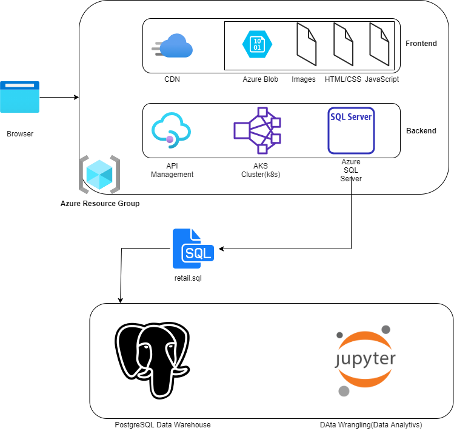

# Introduction
- London Gift Shop (LGS) is a UK-based online store that sells gift-ware for more than 10 years. But the company's revenue is not growing in recent years. The LGS marketing team wants to utilize the latest data technologies to understand their customers better to develop sales and marketing specific techniques. Because most of the customers of the company are wholesalers, the data pattern of the selling is very stable. Since the UGS marketing team doesn't have IT capability and the UGS IT department doesn't have enough resources to work on more projects, UGS CTO decides to engage with Jarvis consulting which offers software and data engineering services.
- The work below is the demonstration of the proof of concept(POC) project that can help the LGS marketing by answering some specific business questions using the data wrangling technics. The data that was provided to Jarvis consultant is the transaction data from 01/12/2009 to 09/12/2011. to store the data, we used a PostgreSQL container and using Jupyter Notebook for the analysis purpose. We utilized the Numpy and Pandas library for Python data manipulation and Matplotlib for the data graphical plotting.

# Project Architecture
- London Gift Shop's rusn on the Microsoft Azure resource group, using Azure's Content Delivery Network to handle the front-end stack, which retrieves resource from Azure Blob. And using Azure's API Management and AKS Cluster(Kubernetes) to handle the back-end API stack. The back end stack contains microservice architecture, using a scalable AKS cluster for the  processing, and a single SQL server for OLTP data. The sample data we had is from this SQL server that to build the proof of conceptfor this project. After that, the retail.sql sample data  is stored in a PostgreSQL instance and interpreted through a Jupyter notebook.
- 

# Data Analytics and Wrangling
- [[Notebook](https://github.com/jarviscanada/jarvis_data_eng_shawn/blob/feature/PythonData/python_data_wrangling/psql/retail_data_analytics_wrangling.ipynb)]
- From the sample retail data, we use matplotlib to visulize the sale trends in the giving years. From the juypternotebook, the results of the RFM segmentation can be found at the bottom of the notebook. In particular, there are three segments which deserve attention. The "Can't Lose" segment contains customers who previously made large purchases, but have since stopped. In order to regain their patronage, a targeted campaign should be ran for them, making specific use of their previously purchased products, while also including new ones similar to them. The "Hibernating" segment is similar to the "Can't Lose" segment, in that it includes customers who purchased in the past, but were not major contributors to the revenue. A campaign similar to the one ran for the "Can't Lose" segment can be ran to entice them into becoming more frequent customers. Finally, the "Champions" segment contains repeat customers who are responsible for a large portion of the revenue. While not at as much of a risk of leaving as the "Can't Lose" segment, it would still be prudent to run a campaign for them to ensure they continue with their repeat patronage.

# Improvements
- Do more analysis on the canceling orders to get ideas about which items got canceled frequently.
- Finding the region influence on the product purchase preference in order to manage the product storing in a different location.
- Doing more researches to increase customer retention by checking at the returning customers
