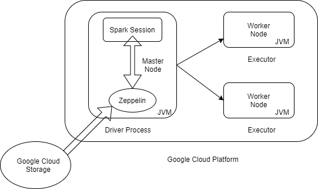
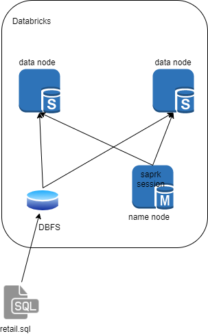

# Spark/Scala Project
## Introduction
- London Gift Shop (LGS) is a UK-based online store that sells gift-ware for more than 10 years. But the company's revenue is not growing in recent years. The LGS marketing team wants to utilize the latest data technologies to understand their customers better to develop sales and marketing specific techniques. Because most of the customers of the company are wholesalers, the data pattern of the selling is very stable. Since the UGS marketing team doesn't have IT capability and the UGS IT department doesn't have enough resources to work on more projects, UGS CTO decides to engage with Jarvis consulting which offers software and data engineering services.
- The work below is the demonstration of the proof of concept(POC) project that can help the LGS marketing by answering some specific business questions using the big data technics. The data that was provided to Jarvis consultant is the transaction data from 01/12/2009 to 09/12/2011. we decided to use Azure Databricks, an Apache Spark service provided by Microsoft. To interact with our Spark cluster we used the PySpark interpreter in Databricks notebooks.

# Zeppelin and Spark Implementation

[[Notebook](https://github.com/jarviscanada/jarvis_data_eng_shawn/blob/feature/Spark/spark/notebook/Retail%20Data%20Analytics%20with%20PySpark.ipynb)]
- We evaluated Spark on a sample World Development Index dataset from the year 2016. The cluster and storage was set up on Google Cloud Platform, arranged as 1 master node and 2 workers configuration. The nodes were loaded with images that were preconfigured for Hadoop and Spark. And the Spark version we used is 2.5 with sparksession which is a new entry point that supersedes SQLContext and HiveContext. Once the cluster was ready, we uploaded the dataset into the Hadoop Distributed File System and created an external Hive table from it. We used PySpark to load this table into a Dataframe which we performed our analytics on. Our analytics mostly consisted of finding historical GDP data on all listed countries.

# Databricks and Spark Implementation

- Our team selected Azure Databricks to carry on the project. The dataset provided by LGS consisted of transaction data between 01/12/2009 and 09/12/2011. The data came in the form of CSV and was uploaded to Azure DBFS, a distributed file system available to our cluster, and read it into our cluster as a Dataframe. The Dataframe spanned all the workers in the cluster which allowed us to leverage more computational power for our work. Our analytical work focused on finding trends in their transactions over the given time frame and categorizing customers based on the recency and frequency of their visits. This information could be used to inform marketing campaigns towards certain customer segments, such as the results of the RFM segmentation can be found at the bottom of the notebook. In particular, there are three segments which deserve attention. The "Can't Lose" segment contains customers who previously made large purchases, but have since stopped. In order to regain their patronage, a targeted campaign should be ran for them, evaluate what they purchased before and Win them back. Talk to them. Make them special offers for the product they purchased before and make them feel valuable. The "Hibernating" segment is similar to the "Can't Lose" segment, in that it includes customers who purchased in the past, but were not major contributors to the revenue.The "new customer" segment is also need some attention, in that it includes customers who purchased in the recent, but they are not contribute a lot of the revenue because of the lack of the new customer. In order to increase the revenue LGS can provide a good onboarding process. Start building the relationship. Finally, the "Champions" segment contains repeat customers who are responsible for a large portion of the revenue. While not at as much of a risk of leaving as the "Can't Lose" segment, LGS can reward them. So they can become evangelists and early adopters of new products.

# Future Improvements
- Do more analysis on the canceling orders to get ideas about which items got canceled frequently.
- Finding the region influence on the product purchase preference in order to manage the product storing in a different location.
- Doing more researches to increase customer retention by checking at the returning customers
